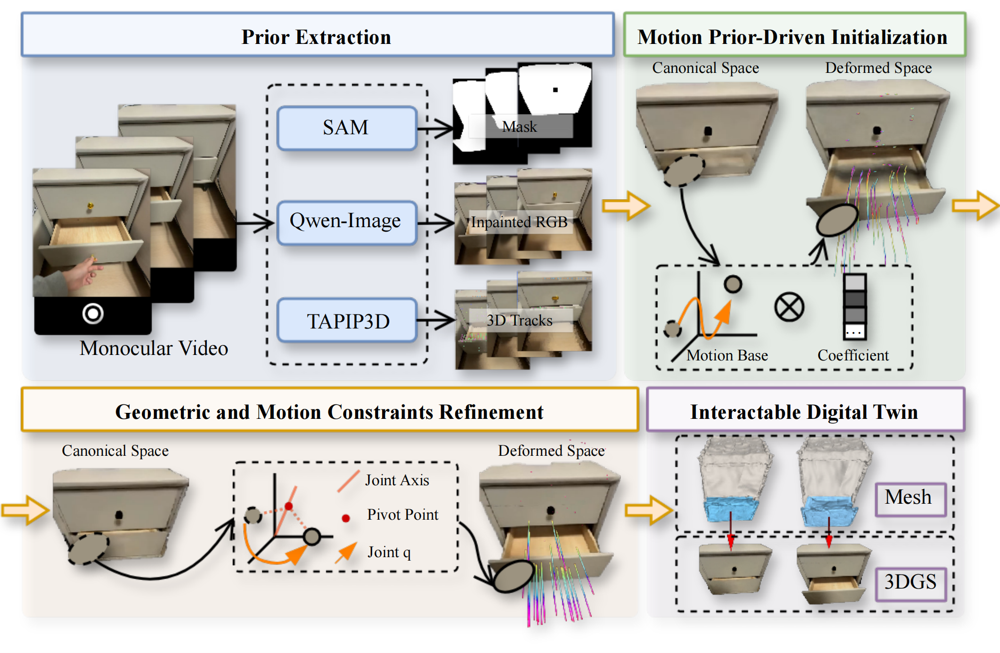

<h1 align="center"> Articulat3D: Reconstructing Articulated Digital Twins From Monocular Videos with Geometric and Motion Constraints </h1>

  	<a href="https://github.com/your_github_id">Lijun Guo</a>*1,
  	<a href="https://github.com/your_github_id">Haoyu Zhao</a>*2,
  	<a href="https://github.com/your_github_id">Xingyue Zhao</a>3,
  	<a href="https://github.com/your_github_id">Rong Fu</a>4,
    <a href="https://github.com/your_github_id">Linghao Zhuang</a>1
    <a href="https://github.com/your_github_id">Siteng Huang</a>5
    <a href="https://github.com/your_github_id">Zhongyu Li</a>2 and
    <a href="https://github.com/your_github_id">Hua Zou</a>✉1

  	1School of Computer Science, Wuhan University &nbsp;&nbsp;
  	2Department of MAE, The Chinese University of Hong Kong &nbsp;&nbsp;
  	3Chinese Academy of Medical Sciences and Peking Union Medical College &nbsp;&nbsp;
  	4University of Macau &nbsp;&nbsp;
  	5Zhejiang University &nbsp;&nbsp;

  <a href="https://arxiv.org/abs/xxxx.xxxxx">arXiv</a> |
  <a href="https://maxwell-zhao.github.io/Articulat3D/">Project Page</a> |
  <a href="https://github.com/ShawnRicardo/Articulat3D">Code</a> |
  <a href="https://your-dataset-link.com">Data</a>

    * Equal contribution &nbsp;&nbsp;
    ✉ Corresponding author

This is the official repository of **Articulat3D: Reconstructing Articulated Digital Twins From Monocular Videos with Geometric and Motion Constraints**. For more information, please visit our project page.

  

## Acknowledgement

This code heavily used resources from [PARIS](https://github.com/3dlg-hcvc/paris), [Shape of Motion](https://github.com/vye16/shape-of-motion), [TAPIP3D](https://github.com/zbw001/TAPIP3D). We thank the authors for open-sourcing their awesome projects.
